# Cryptocurrency Price Prediction Model

## Introduction
As the world’s financial markets become increasingly more complex, the need to provide investors, traders, and financial institutions with powerful tools to make well-informed decisions and mitigate the risks involved in financial trading becomes ever more demanding. With the constant evolving nature of financial markets, the ability to anticipate market trends and price fluctuations is critical to making sound financial decisions. Incidentally, the current market has evolved to trading cryptocurrencies with its ever increasing popularity in recent years. The volatility and complexity of digital asset markets have led to a growing demand for sophisticated tools and models that can provide valuable insights to traders, investors, and enthusiasts alike. To address this need, this project entails the development of an AI model that is able to process large amounts of financial data in order to determine the price fluctuations of different sets of cryptocurrencies over a short period of time.

## Data Exploration and Preprocessing
In the process of developing a cryptocurrency price prediction model, Google Colab and yfinance were utilized within a Jupyter Notebook environment to analyze the latest data on prominent cryptocurrencies, focusing on Bitcoin due to its significant market presence. The analysis incorporated five key features: close price, open price, daily high, daily low, and trading volume, recognized as crucial indicators of market movement. The dataset spanned from August 1, 2019, to August 1, 2023, totaling 1461 data points per feature, with no missing values encountered during preprocessing. The data was partitioned into training, validation, and testing sets (1021, 100, and 100 data points respectively) without shuffling to maintain the chronological sequence, crucial for the model's predictive accuracy. To ensure no overlap of information, a 60-day gap was placed between the training and validation sets. Min-max scaling was applied to normalize the features, fitted on the training data to avoid information leakage, and then applied to the validation and testing sets. The primary objective is to predict the close price using the past 60 days of data. Custom functions were developed for data preparation: get_Xy for generating sequences and corresponding labels, and set_split for dataset partitioning. The prepared Bitcoin data was then processed and scaled, setting the stage for LSTM model training with input-output pairs generated for analysis, demonstrating the preprocessing steps and data preparation through plotted scaled values.

## Model 1: Multi-Feature LSTM
The first LSTM model consists of two LSTM layers, each with 50 units, and two dense layers, one with 25 units and the other serving as the output layer. It takes in inputs of "Open", "Volume", "Close", "High", "Low" from the past 60 days and outputs a predicted "Close". We use hyperbolic tangent as the LSTM cell state activation function, sigmoid as the forget/filter gates' activation function, and linear function as the dense layer's activation function. Since we are dealing with multiple features, the input layer will have a shape of (60, 5). The predicted price is for the next day only, so that the output layer will have only 1 unit.

Optimization Parameter: Adam optimizer, with learning rate set to 0.01; 50 epochs of training with batch size 1

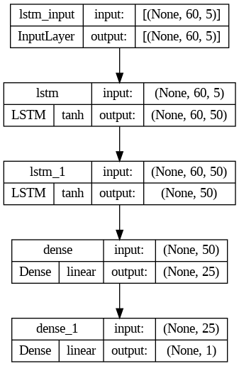

## Model 2: Single-Feature LSTM
The single-feature LSTM model will have exactly the same architecture as the multi-feature one, except for the change in input dimension. This model will only take close price from the previous 60 days as input. Thus, we have a input dimension of (60,1) and the output layer with 1 unit.

Optimization Parameter: Adam optimizer, with learning rate set to 0.01; 50 epochs of training with batch size 1

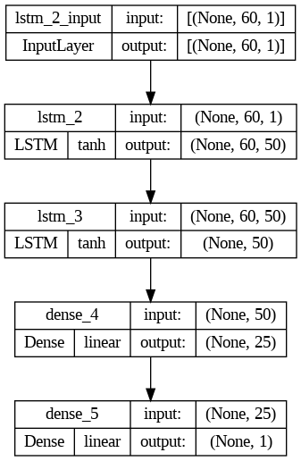

## Model 3: Multi-Feature RNN
The multi-feature RNN consists of two simple RNN layers with ReLU activation function as well as two dense layers with linear activation function. Both RNN layers contain 64 nodes; the first dense layer contains 30 nodes and the last dense layer contains exactly one node as output. Like before, we have an input dimension of (60,5) and an output dimension of 1.

Optimization Parameter: Adam optimizer, with learning rate set to 0.01; 50 epochs of training with batch size 1

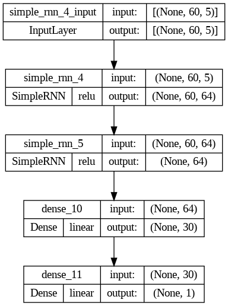

## Parameter Tuning
To find the best combination of model parameters, randomized grid search (without CV) was applied. Working with a highly flexible neural network model, the strategy is to first define a custom function that takes all the parameter as its argument. The function will build a model with the specified parameter set, which is then to be wrapped up in a KerasRegressor object. A KerasRegressor has "fit" and "predict" functionality, which allows to train the model and obtain the corresponding training and testing loss. Several parameters were fine-tuned, including the activation functions for the LSTM layers (activation functions both for the gates and for the cell states) and dense layers, number of LSTM layers, the learning rate and number of epochs, and lastly, whether global average pooling (1D) is applied. 

## Model 4: Fine-Tuned Multi-Feature LSTM
After parameter tuning, the multi-feature RNN now contains 2 LSTM layers and 3 dense layers (with the last dense layer being the output layer). The first and second LSTM contain 32 and 16 nodes, respectively. As for activation functions, sigmoid was used for cell gates and hyperbolic tangent was used for each cell's output layer. Linear activation function is used for all dense layers. The model has an input dimension of (60, 5) and an output dimension of 1.

Optimization Parameter: Adam optimizer, with learning rate set to 0.001; 124 epochs of training with batch size 1.

**P.S.** For this model, early-stopping is used to find the best number of epochs. The training automatically stops if the testing loss stops dropping (as compared to the best loss) for 30 consecutive epochs.

## Extra Model A: Many-to-Many LSTM
The many-to-many LSTM serves as an extension of the first multi-feature LSTM. It has a similar model architecture as Model 1 (Multi-Feature LSTM), except for increased number of nodes. The same set of activation function is used as the fine-tuned multi-feature LSTM. Specifically, this model has 3 LSTM layers with 128, 64 and 32 nodes, respectively. Two dense layers are added, with the first dense layer containing 25 nodes and the second (also the last) containing 3 nodes. The input dimension is (60,5) and the output dimension is 3. We use model to try to make multi-day predictions.

Optimization Parameter: Adam optimizer, with learning rate set to 0.0003; 200 epochs of training with batch size 1.

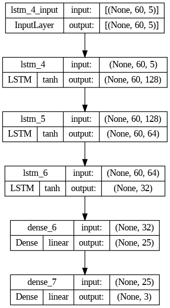

## Extra Model B: Stateful LSTM
This model allows information from previous batches to be memorized and passed down, in contrast to regular LSTM, which assumes that different batchs of data are independent. The stateful LSTM has exactly the same model structure as Extra Model A, except for changes in the input and output dimension. For this model, input data has shape (1,1,1), which stands for 1 sample to use for prediction, 1 time shift applied (looking at predicion of next day's price using previous day's features) and 1 feature in the input. The output shape is 1.

Optimization Parameter: Adam optimizer, with learning rate set to 0.01; 5 epochs of training, each with the entire dataset.

## Results
### Data Exploration and Preprocessing
**Before rescaling**

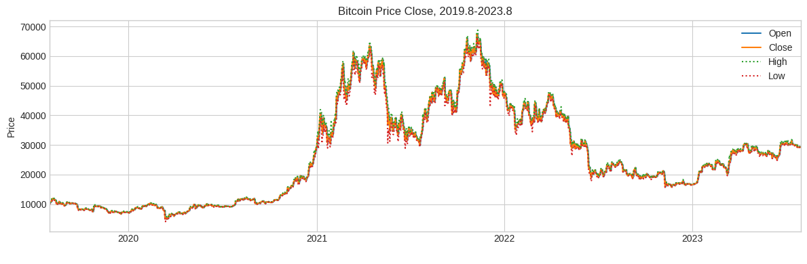

**After spliting and scaling**

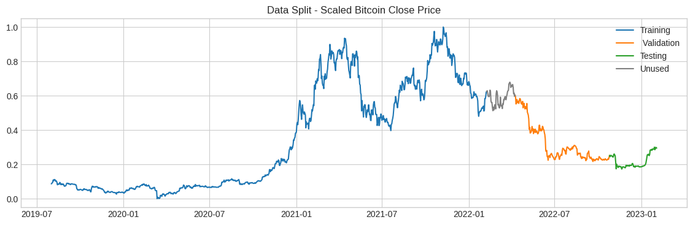

### Model 1: Multi-Feature LSTM
#### Training and Testing Loss

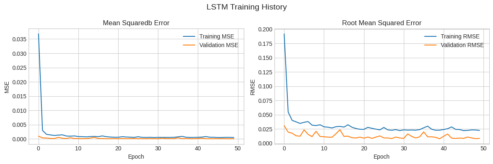

#### Next-Day Prediction
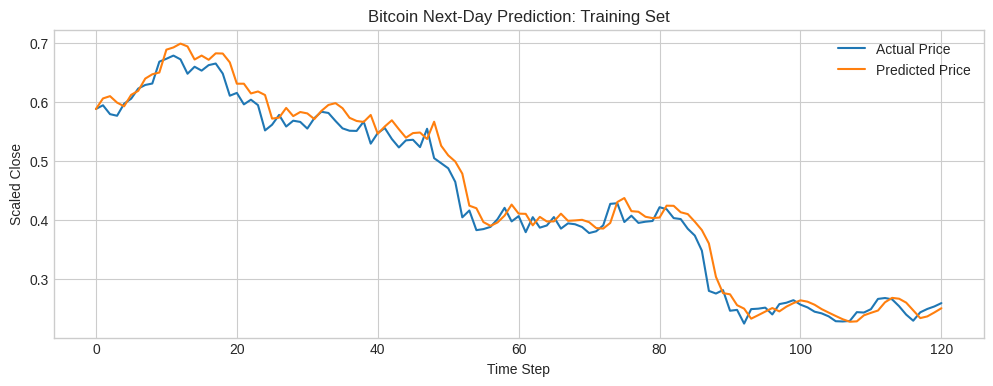

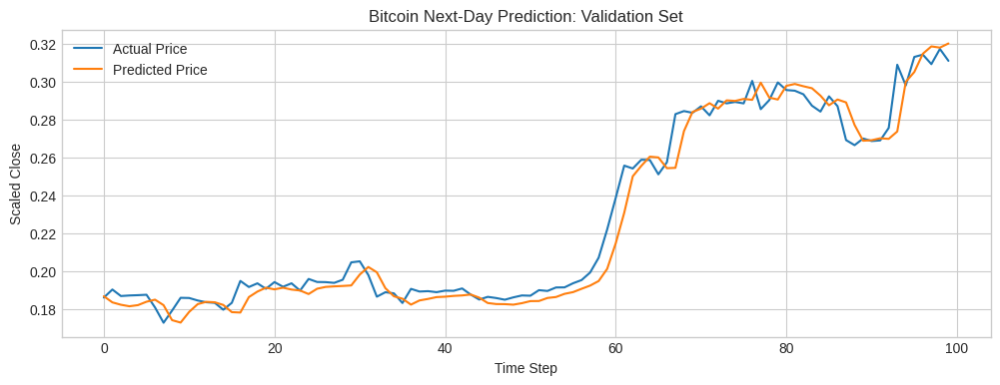

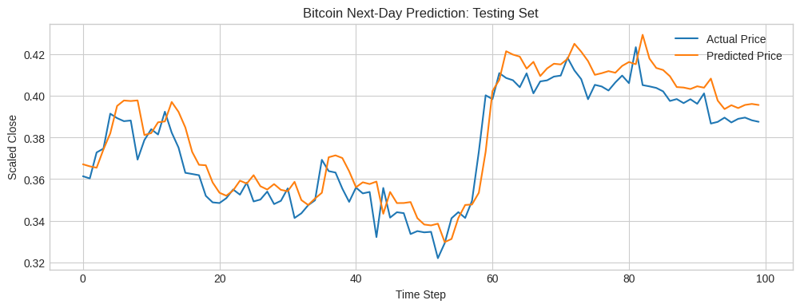

### Model 2: Single-Feature LSTM
#### Training and Testing Loss

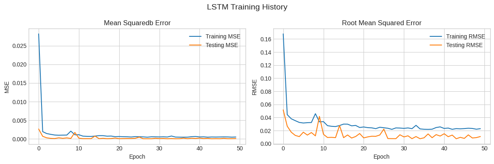

#### Next-Day Prediction
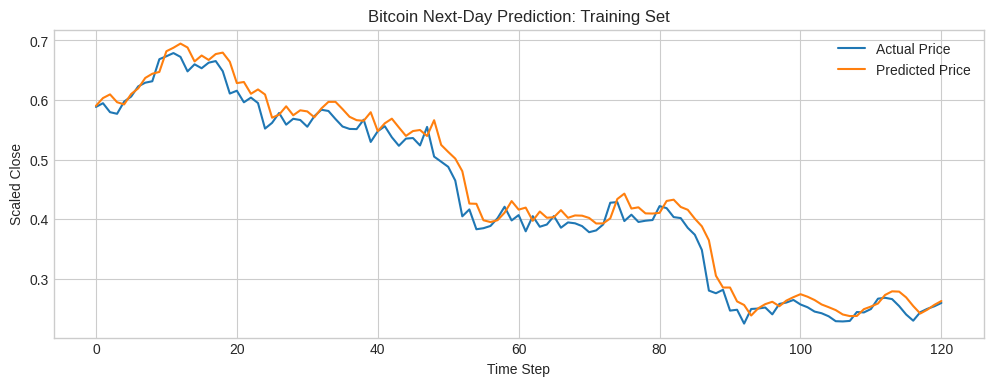
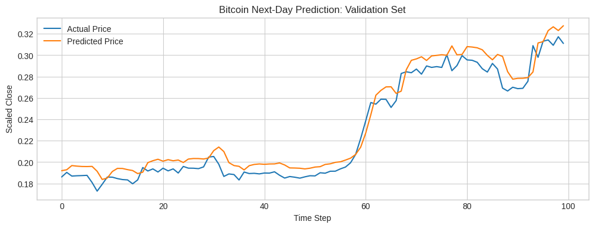
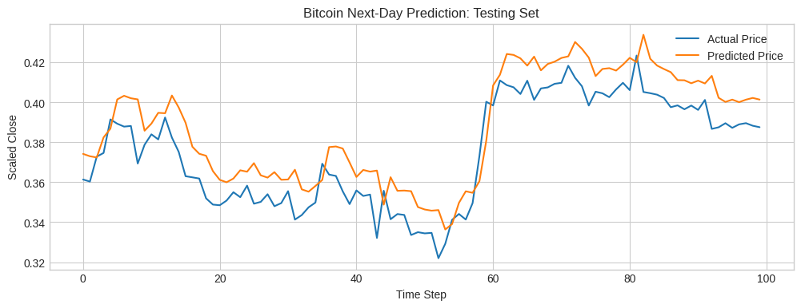

### Model 3: Multi-Feature RNN
#### Training and Testing Loss

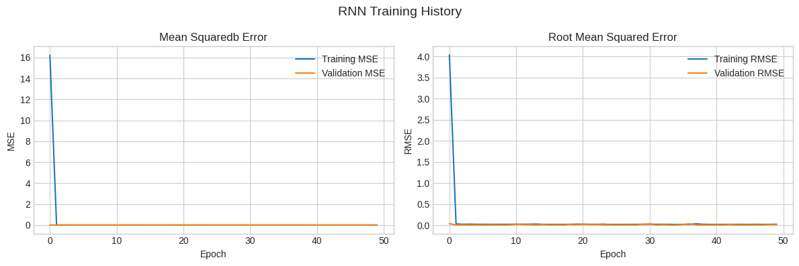

#### Next-Day Prediction
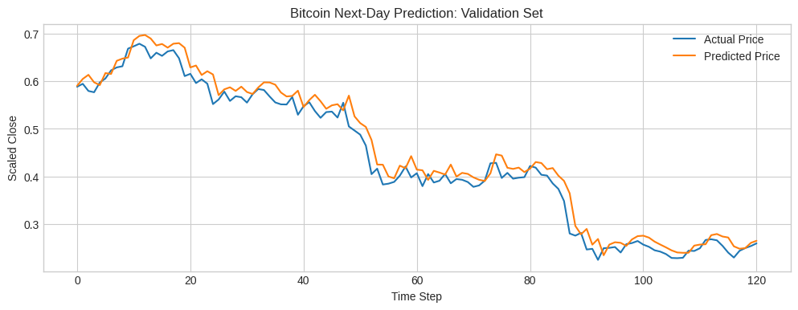
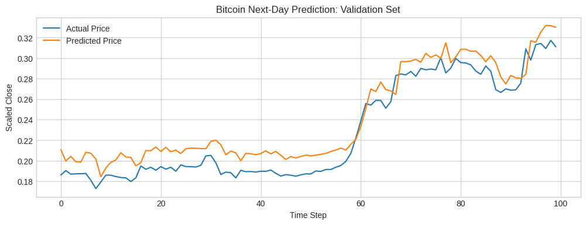
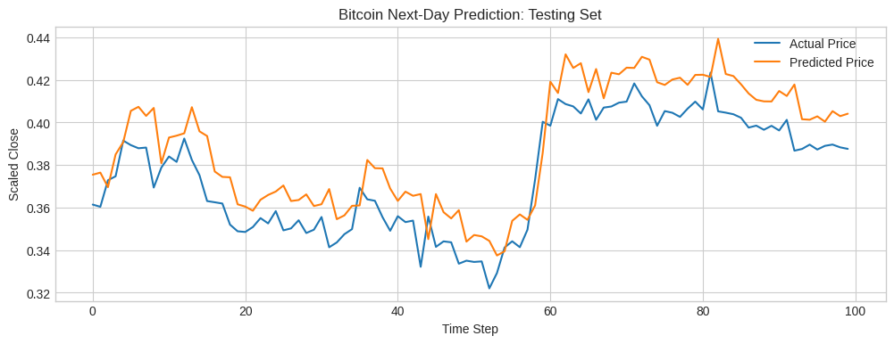

### Comparison of Model 1, 2 and 3
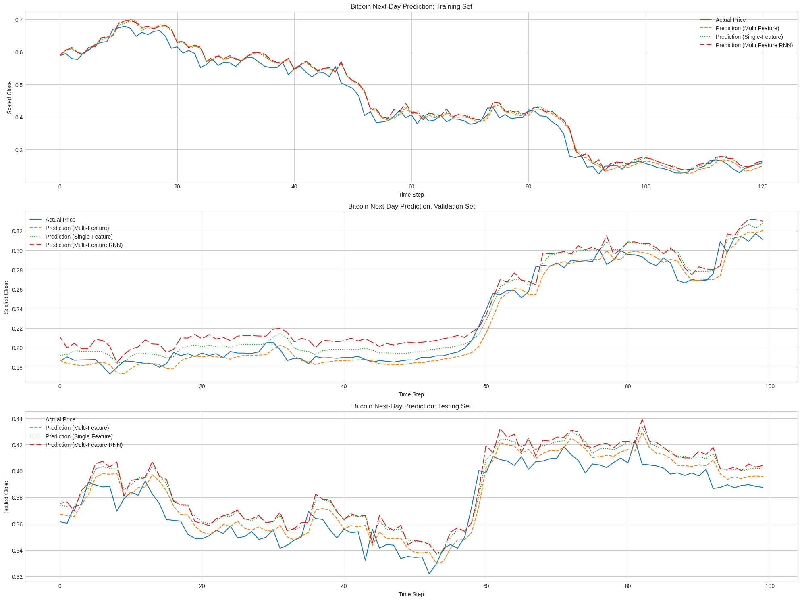

### Model 4: Fine-Tuned Multi-Feature LSTM
#### Training and Testing Loss
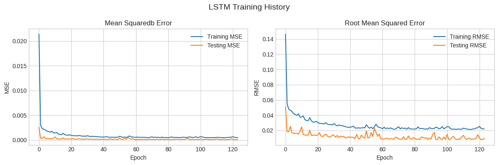

#### Next-Day Prediction
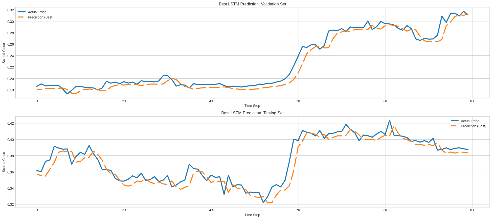

### Extra Model A: Many-to-Many LSTM
#### 3-Day Prediction
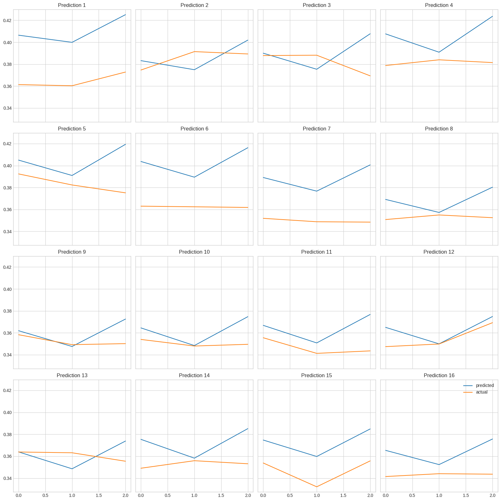

### Extra Model B: Stateful LSTM
#### 100-Day Prediction
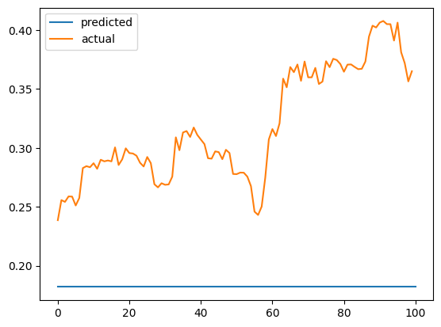

